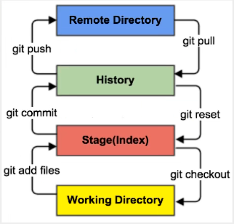

***
# Git安装与配置
***
### https://git-scm.com/下载安装  
### 速度慢解决方案1：翻墙；方案2：镜像下载
### 安装过程选择Git默认编辑器时可根据自身习惯选用，其余常规下一步即可，有能力者可自行选择。

***
# **Git理论核心**
***
### Git主要功能进行版本管理与控制，整个工作区域可分为工作目录、暂存区、本地仓库、远程仓库。文件在这四个区域转换连接

### 工作区：项目代码储存位置
### 暂存区: 存放改动，以文件形式保存在本地
### 本地仓库：提交所有版本文件数据储存位置，形式为初始化后工作区产生的.git文件夹
### 远程仓库：托管项目代码的服务器，可帮助项目工作组进行数据交换和协同开发

***
# 初始化
***
### linux基本命令不再赘述
### 在目标工作目录下右键选择git bash here
git init      

***
# 忽略文件
***
### 避免将数据库文件、临时文件、设计文件、缩略图等文件纳入版本控制，避免已经push了忽略文件，因此放在一开始进行。
/*  
!.gitignore  
*.m
### 说明：忽略全部内容，但是不忽略.itignore 文件，不忽略.m脚本文件。其余文件忽略格式可自行搜索编写。

***
# 文件
***
### 以下操作基于主分支“master”
### 查看所有文件状态
git status
### 查看指定文件状态
git status [filename]
### 添加所有文件到暂存区
git add .
### 提交暂存区到本地仓库
git commit -m ["test提交test"]
### 建立远程仓库
git remote add origin ["远程仓库地址"]
### 将本地仓库的分支推送到远程仓库对应分支
git push origin master：refs/for/master
### 将远程仓库克隆到本地(无需初始化git init)，去掉本地目录名即与远程仓库同名
git clone ["远程仓库地址"] ["本地目录名"]
### 将远程仓库的一个分支克隆到本地
git fetch
### 拉取远程仓库的一个分支，并与本地指定  分支合并，若去掉冒号之后的字符串，则表示和本地当前分支合并
git pull ["远程仓库名"] ["远程分支名"]:["本地分支名"] 
### git pull = git fetch + git merge

***
# 分支
***
### 理解为平行时空，可同时进行主分支和多条次分支的开发处理，达到稳定无bug后可合并为更新版本
### 新建一个分支，但依然停留在当前分支
git branch [branch-name]
### 新建一个分支，并切换到该分支
git checkout -b [branch]
### 合并指定分支到当前分支
git merge [branch]
### 删除分支
git branch -d [branch-name]
### 删除远程分支
git push origin --delete [branch-name]
git branch -dr [remote/branch]